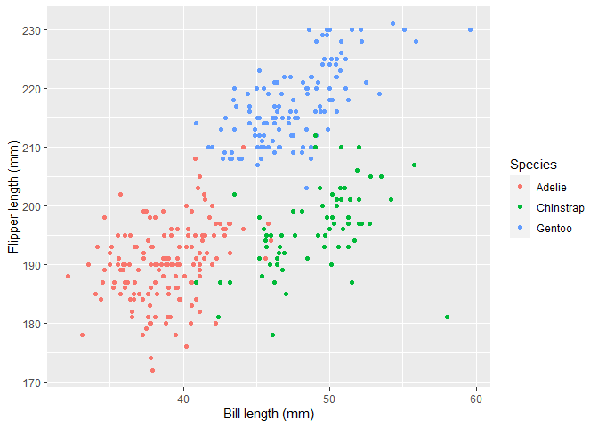

Homework 1
================
Alexander Melamed
2020-09-17

# Problem 0.1

I have created an .Rmd file named **p8101\_hw1\_am5195.Rmd** which
renders the Markdown as a *github* document.

# Problem 0.2

Nothing for me to do here

# Problem 1

In the codechunk below, I create a data frame by drawing 10 times from a
standard Normal distribution, constructs a logical vector indicating
whether elements of the sample are greater than 0, a character vector of
length 10, a factor vector of length 10, with 3 different factor
“levels”

``` r
##set seed to ensure reproducibility
set.seed(1)

##define data frame called "hw1_df" containing norm_samp norm_samp_pos char_vec and fact_vec
hw1_df = tibble (                  
  norm_samp = rnorm(10),           
  norm_samp_pos = norm_samp > 0,  
  char_vector = c("This", "is", "the", "form", "for", "words", "and", "other", "text","."),
  fact_vec = factor(c("1","1","1","2","2","2","3","3","3","3"))
  )


##display the dataframe
hw1_df  
```

    ## # A tibble: 10 x 4
    ##    norm_samp norm_samp_pos char_vector fact_vec
    ##        <dbl> <lgl>         <chr>       <fct>   
    ##  1    -0.626 FALSE         This        1       
    ##  2     0.184 TRUE          is          1       
    ##  3    -0.836 FALSE         the         1       
    ##  4     1.60  TRUE          form        2       
    ##  5     0.330 TRUE          for         2       
    ##  6    -0.820 FALSE         words       2       
    ##  7     0.487 TRUE          and         3       
    ##  8     0.738 TRUE          other       3       
    ##  9     0.576 TRUE          text        3       
    ## 10    -0.305 FALSE         .           3

The variable `norm_samp` has the class numeric, the variable
`norm_samp_pos` has the class logical, the variable `char_vector` has
the class character, and the variable `fact_vec` has the class factor.

R has no problems taking the mean of numeric and logical variable:

``` r
## take the mean of variabls "norm_samp" and "norm_samp_pos" from the data frame "hw1_df"  

mean(pull(hw1_df,norm_samp,))
```

    ## [1] 0.1322028

``` r
mean(pull(hw1_df,norm_samp_pos,))
```

    ## [1] 0.6

But if you try to do this with character or factor variable it gets mad:

``` r
## take the mean of variabls "char_vector" and "fact_vec" from the data frame "hw1_df"  

mean(pull(hw1_df,char_vector,))
```

    ## Warning in mean.default(pull(hw1_df, char_vector, )): argument is not numeric or
    ## logical: returning NA

    ## [1] NA

``` r
mean(pull(hw1_df,fact_vec,))
```

    ## Warning in mean.default(pull(hw1_df, fact_vec, )): argument is not numeric or
    ## logical: returning NA

    ## [1] NA

You can use the `as.numeric` function to convert some types of variables
to numeric variables.

``` r
## try to convert "norm_samp_pos", char_vector", and "fact_vec" to numeric variables

norm_samp_pos =as.numeric(pull(hw1_df,norm_samp_pos))
char_vector =as.numeric(pull(hw1_df,char_vector))
fact_vec =as.numeric(pull(hw1_df,fact_vec))

mean(fact_vec)
```

For a logical vector `as.numeric` will convert values of FALSE to 0s and
values of TRUE to 1s. For a factor vector `as.numeric` will assign
integer values to each level of the factor. However, for character
vector `as.numeric` will convert each value to an “NA.” It appears that
the mean function can implicitly undertake this conversion for a logical
vector and produce a mean. This makes sense since the mean is easily
interpertable the the proportion of observations that take the value
TRUE. However for factor vectors mean produces an error, meaning
function does not implicitly convert the factor levels to numeric
variables. This also makes sense, because this mean is likely to be
meaningless. Of course mean produces an error for the character vector.

The next code chunk demonstrates:

  - how the logical vector `norm_samp_pos` can be converted to a numeric
    vector and multiplied by the numeric vector `norm_samp`

  - how the logical vector `norm_samp_pos` can be converted to a to a
    factor, and multiplied by the numeric vector `norm_samp`

  - how the logical vector `norm_samp_pos` can be converted to a to a
    factor, how the resulting factor can be converted to a numeric, and
    and multiplied by the numeric vector `norm_samp`

<!-- end list -->

``` r
## convert the logical vector to numeric, and multiply the random sample by the result

norm_samp_pos =as.numeric(pull(hw1_df,norm_samp_pos))
norm_samp_pos*(pull(hw1_df,norm_samp))
```

    ##  [1] 0.0000000 0.1836433 0.0000000 1.5952808 0.3295078 0.0000000 0.4874291
    ##  [8] 0.7383247 0.5757814 0.0000000

``` r
##convert the logical vector to a factor, and multiply the random sample by the result
norm_samp_pos =as.factor(pull(hw1_df,norm_samp_pos))
norm_samp_pos*(pull(hw1_df,norm_samp))
```

    ## Warning in Ops.factor(norm_samp_pos, (pull(hw1_df, norm_samp))): '*' not
    ## meaningful for factors

    ##  [1] NA NA NA NA NA NA NA NA NA NA

``` r
##convert the logical vector to a factor and then convert the result 
##to numeric, and multiply the random sample by the result
norm_samp_pos =as.factor(pull(hw1_df,norm_samp_pos))
norm_samp_pos =as.numeric(norm_samp_pos)
norm_samp_pos*(pull(hw1_df,norm_samp))
```

    ##  [1] -0.6264538  0.3672866 -0.8356286  3.1905616  0.6590155 -0.8204684
    ##  [7]  0.9748581  1.4766494  1.1515627 -0.3053884

# Problem 2

The following code chunk loads the `penguins` dataset:

``` r
data("penguins", package = "palmerpenguins")
```

The dataset `penguins` includes the following variables: species,
island, bill\_length\_mm, bill\_depth\_mm, flipper\_length\_mm,
body\_mass\_g, sex, year. The data has 344 rows and 8 columns. The mean
flipper length is 201mm.

The following code chunk creates a scatter plot of `flipper_length_mm`
on the y-axis vs `bill_length_mm` on the x-axis.

``` r
##Generate plot
ggplot(penguins, aes(            
  x = bill_length_mm,            #assigns bill_length to x-axis
  y = flipper_length_mm,         #assigns flipper_length to y-axis
  color = species)) +            #assigns species different colors
  geom_point()+                  #specifies scatter plot
  labs(                          # formats labels
    y= "Flipper length (mm)",    
    x = "Bill length (mm)", 
    color = "Species")
```

<!-- -->

``` r
##Save plot as a .pdf file in project directorty
ggsave("HW1_p2_plot.pdf")
```

    ## Saving 7 x 5 in image
